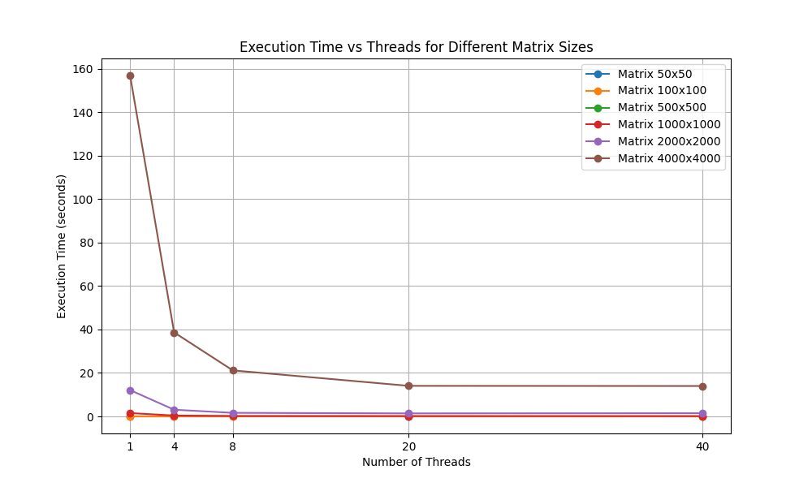

# m6 Matrix Multiplication Program

## Details:
Created by **Xander Pickering** (*3118504*) \
Last updated: **2024/12/08**

## Overview:
`m6.c` is a high-performance program for multiplying two square matrices stored in binary format. The program utilizes multithreading to parallelize the computation, achieving significant performance gains for large matrices.

The program accepts two binary input files representing matrices and outputs the resulting matrix either to a specified binary file or discards the result if no output
file is provided.

## Features:
- **Binary Matrix Multiplication**: Supports multiplication of square matrices stored as 32-bit integers in binary files.
- **Multithreading**: Leverages `pthread` to parallelize matrix row computation.
- **Memory Mapping**: Uses `mmap` for efficient file access and reduced memory usage.
- **Error Handling**: Detects and handles invalid file formats, mismatched dimensions, and memory allocation issues.
- **Configurable Threads**: Allows the user to specify the number of threads for optimal performance.

## Multithreading Design:
The program employs multithreading to parallelize the computation of matrix multiplication. Here's how shared variables and work splitting are managed:
### Shared Variables:
1. Input Matrices (`A` and `B`):
    - Both matrices are memory mapped and shared among threads.
    - Threads only read from these matrices, ensuring no data race occurs.
2. Output Matric (`C`):
    - Shared among all threads.
    - Each thread writes to a distinct set of rows in the output matrix, ensuring no overlap or race conditions.
3. Thread Arguments (`thread_args_t`):
    - Each thread receives a unique instance of `thread_args_t` containing:
        - Pointers to the shared matrices `A`, `B` and `C`.
        - The matrix dimension (`dimension`).
        - The range of rows (`start_row`, `end_row`) that the thread is responsible for processing.
### Work Splitting:
- The matrix rows are divided evenly among threads.
- Each thread processes a contiguous range of rows in the output matrix:
    - The number of rows per thread is calculated as `rows_per_thread = dimension / num_threads`.
    - Any remaining rows are distributed one by one to the first few threads (*i.e* `remainder = dimension % num_threads`).

> **For example**, if a 1024x1024 matrix is processed with 4 threads:
> - Each thread handles approximately 256 rows.
> - If there are extra rows (*i.e 1026 rows*), the first two threads will handle 257 rows each, while the others handle 256 rows.

### Benefits:
- **No contention**: Threads work independently on their assigned rows, minimizing sync overhead.
- **Scalability**: The program scales well with the number of threads for large matrices.
- **Efficiency**: Shared memory (`mmap`) and precise row division optimize both memory and CPU usage.

### Performance Metrics:
This graph documents the performance of the program with various thread counts and matrix sizes (*and was created with a simple Python script utilizing `matplotlib` for graphing*):


We can see that the performance scales exponentially with the number of threads used, confirming the benefits of a multithreaded approach.

## Valgrind Diagnostics:
Running the program through `valgrind` (*with a matrix size of 1000x1000*) produces the following output, indicating zero possible memory leaks during execution:
```
Multiplying arrays of dimension 1000
==31775== 
==31775== HEAP SUMMARY:
==31775==     in use at exit: 0 bytes in 0 blocks
==31775==   total heap usage: 23 allocs, 23 frees, 7,424 bytes allocated
==31775== 
==31775== All heap blocks were freed -- no leaks are possible
==31775== 
==31775== For lists of detected and suppressed errors, rerun with: -s
==31775== ERROR SUMMARY: 0 errors from 0 contexts (suppressed: 0 from 0)
```

## Dependencies:
- **GCC** (*tested with gcc-10*)
- **A POSIX-compliant environment** (*Linux, macOS, etc.*)

## Files:
- **m6.c**: The source code implementing the matrix multiplication logic.
- **Makefile**: Automates the build process for compiling the program.

## Compilation:
To compile the program, use the provided `Makefile`. Simply run:
```sh
make
```
This will compile `m6.c` and create an executable named `m6`.

## Usage:
```sh
./m6 <input1.dat> <input2.dat> -t <num_threads> [-o <output_file>]
```
### Parameters:
- **<input1.dat>**: Binary file containing the first matrix.
- **<input2.dat>**: Binary file containing the second matrix.
- **-t <num_threads>**: Number of threads to use for computation (*required*)
- **-o <output_file>**: Binary file to save the resulting matrix. If omitted, the result
is discarded.

## Example:
Multiply two 1024x1024 matrices stored in `matrix1.dat` and `matrix2.dat` using 4 threads, saving the result to `result.dat`:
```sh
./m6 matrix1.dat matrix2.dat -t 4 -o result.dat
```
If you want to discard the result:
```sh
./m6 matrix1.dat matrix2.dat -t 4
```

## Error Handling:
The program will print error messages and exit for the following cases:
- **File access issues** (*e.g., non-existent or inaccessible input files*).
- **Invalid matrix file formats** (*e.g., not 32-bit integers or not square*).
- **Mismatched matrix dimensions**.
- **Memory allocation or thread creation failures**.

## Makefile Details:
The `Makefile` simplifies the compilation and cleanup process.
### Targets:
- `all`: Builds the `m6` executable.
- `clean`: Removes the compiled `m6` binary.

## Testing:
1. Create binary matrix files. Example code snippet in Python:
```py
import numpy as np
matrix = np.random.randint(0, 10, size=(1024, 1024), dtype=np.int32)
matrix.tofile("matrix1.dat")
```
2. Run the program with the generated files:
```sh
./m6 matrix1.dat matrix2.dat -t 4 -o result.dat
```

## Performance Tips:
- Use a number of threads matching the number of physical CPU cores for optimal performance.
- Larger matrices benefit more from multithreading and memory-mapped I/O.
- Benchmark with different thread counts to find the ideal configuration for your system.